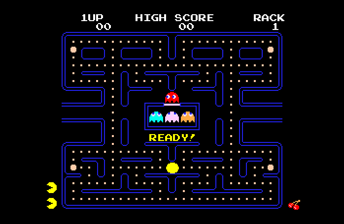
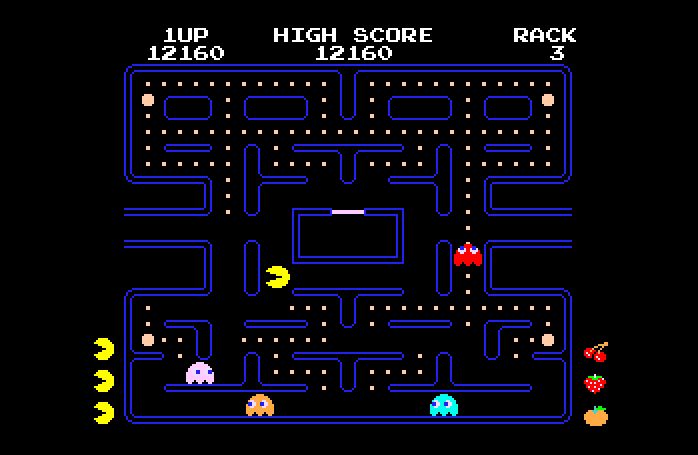

# GS.Pacman
GS.Pacman is a Pacman clone for the Apple IIGS computer. It is written in 65816 assembly and built from scratch to run on the IIGS natively under the GSOS desktop.

## General Info
PLEASE REFER TO [THE WIKI](https://github.com/peterhirschberg/GS.Pacman/wiki) FOR CONTROLS AND OTHER INFO

## Downloads
GO [HERE](https://github.com/peterhirschberg/GS.Pacman/releases) TO DOWNLOAD

## Screenshots

